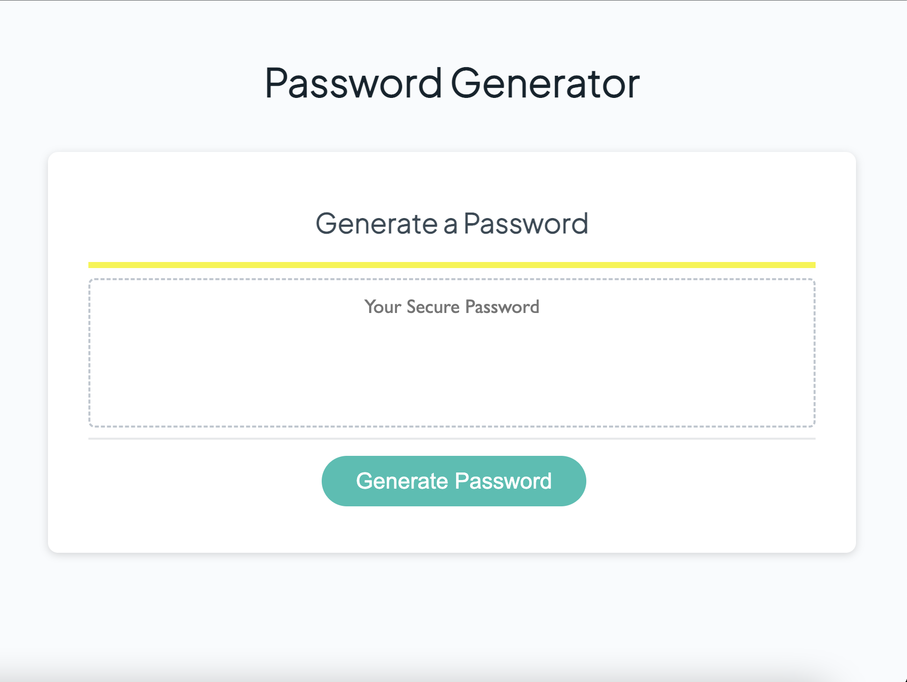

# Random Password Generator
A password generator is a software tool that creates random or customized passwords for users. It helps users create stronger passwords that provide greater security for a given type of access.
The present Password Generator application will ask the User to confirm if they want to include uppercase letters, numbers or special characters.

## Built with
- HTML
- CSS 
- JavaScript

## Final Result

## Link to Password Generator

This is the link to the [Password Generator](https://cdrcar.github.io/Password-Generator/)

## License
[MIT](https://choosealicense.com/licenses/mit/)
